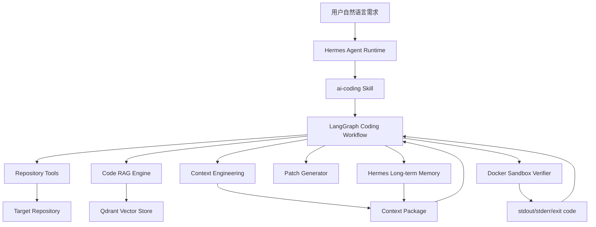
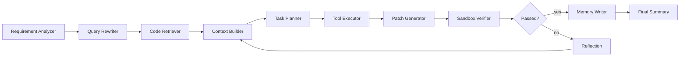

# Hermes Agent AI Coding Extension Design

## 1. 项目定位

本项目是在 Hermes Agent 原有框架基础上扩展的 AI Coding Agent 能力，不重新实现一个独立平台，也不引入传统 Java Web 后端体系。扩展目标是让 Hermes Agent 在已有的工具调用、技能系统、长期记忆、模型抽象、子 Agent 与 Docker 执行后端基础上，具备面向代码库的理解、检索、上下文工程、任务规划、Patch 生成和沙箱验证能力。

项目核心亮点从普通 RAG 问答升级为 AI Coding Agent + Context Engineering。Agent 不只是检索代码片段，而是将用户需求、仓库结构、相关源码、历史任务记忆、工具调用结果、错误日志和测试反馈组织成高质量上下文包，辅助大模型完成多步骤代码任务。

## 2. 设计目标

### 2.1 功能目标

- 支持自然语言描述代码任务，例如功能开发、Bug 修复、报错分析、代码重构建议。
- 自动分析目标仓库结构，识别 README、配置文件、依赖文件、源码文件和测试文件。
- 构建代码 RAG 检索能力，支持按需求、错误日志、函数名、文件名召回相关代码片段。
- 通过 Context Engineering 生成面向 LLM 的任务上下文包，控制 Token 预算并降低无关上下文干扰。
- 基于 Hermes Agent 的工具系统扩展代码读取、搜索、Patch 预览、测试命令生成、Docker 沙箱执行等工具。
- 复用 Hermes Agent 的长期记忆机制，沉淀项目结构、历史修复经验、常见错误和用户偏好。
- 复用 Hermes Agent 的子 Agent 能力，将复杂任务拆分给检索、规划、验证等角色并行处理。

### 2.2 非目标

- 不设计完整 Web 平台、用户系统、管理后台或权限系统。
- 不重复博客项目中的 Spring Boot、MySQL、Redis、JWT、MyBatis-Plus 等技术栈。
- 不将 Docker 作为服务部署卖点，而是作为 Agent 代码执行与测试验证的隔离环境。
- 不追求一次性替代完整 IDE，而是实现一个可落地、可演示、可继续扩展的 AI Coding Agent 扩展。

## 3. 现有 Hermes Agent 能力复用

本扩展默认基于 NousResearch/hermes-agent 的框架思想进行设计，保留以下基础能力：

- CLI/TUI 会话入口：用户通过 Hermes 原有交互方式提交 coding 任务。
- 模型抽象：继续复用 Hermes 的模型切换能力，支持不同 LLM 后端。
- Tool Calling：将 AI Coding 所需能力封装为 Hermes 可调用工具。
- Skills 机制：以 `ai-coding` Skill 形式沉淀任务流程、提示词模板和上下文规范。
- 长期记忆：复用 Hermes 的记忆系统保存项目知识和历史经验。
- 子 Agent：复杂任务拆分为多个角色并行处理，再由主 Agent 汇总。
- Docker 执行后端：用于隔离运行测试命令、静态检查和补丁验证。

## 4. 总体架构



系统由四层组成：

1. Hermes Runtime 层：保留原有 CLI/TUI、模型抽象、工具调用、记忆和执行后端。
2. AI Coding Skill 层：定义 coding 任务的流程规范、提示词模板、输出格式和工具使用约束。
3. Agent Workflow 层：使用 LangGraph 编排需求理解、代码检索、上下文组装、计划生成、Patch 生成和沙箱验证。
4. Tool & Storage 层：提供代码扫描、代码搜索、向量检索、Patch 预览、Docker 执行、记忆读写等能力。

## 5. 核心模块设计

### 5.1 ai-coding Skill

`ai-coding` Skill 是本扩展的入口。它负责告诉 Hermes Agent 如何处理代码任务，包括任务拆解方式、上下文格式、工具调用顺序、输出结构和安全边界。

Skill 主要包含：

- `SKILL.md`：描述 AI Coding Agent 的使用场景、工作流程和工具调用规范。
- `prompts/requirement_analysis.md`：需求理解和任务分类提示词。
- `prompts/context_package.md`：上下文包组装规范。
- `prompts/patch_generation.md`：Patch 生成和修改解释规范。
- `prompts/reflection.md`：失败日志分析与二次修正提示词。

### 5.2 Code RAG Engine

Code RAG Engine 负责将代码库转换为可检索知识。

输入：

- 源码文件，例如 `.py`、`.ts`、`.js`、`.java`、`.go`。
- 项目说明文件，例如 `README.md`、`docs/*.md`。
- 配置文件，例如 `pyproject.toml`、`package.json`、`requirements.txt`、`Dockerfile`。
- 测试文件，例如 `tests/`、`*_test.py`、`*.spec.ts`。

处理流程：

1. 仓库扫描：过滤 `.git`、`node_modules`、`.venv`、`dist`、`build` 等无关目录。
2. 文件分类：区分源码、测试、文档、配置、脚本。
3. 语义分块：优先按函数、类、模块边界分块；不支持语法解析时退化为滑动窗口分块。
4. 元数据提取：记录路径、语言、符号名、起止行号、文件类型、最近修改时间。
5. 向量化：使用 Embedding 模型生成代码块向量。
6. 入库：写入 Qdrant，支持按项目和分支隔离。

输出：

- 可通过自然语言、错误日志、符号名进行召回的代码块集合。
- 供 Context Engineering 模块使用的候选上下文片段。

### 5.3 Context Engineering

Context Engineering 是本项目的关键技术点。它负责把分散的信息组织为 LLM 真正可用的上下文，而不是简单拼接检索结果。

#### 5.3.1 Context Package 结构

```yaml
task:
  user_request: string
  task_type: feature | bugfix | refactor | explanation | test
  constraints: string[]

repository:
  summary: string
  language_stack: string[]
  entrypoints: string[]
  dependency_files: string[]

retrieved_context:
  source_chunks:
    - path: string
      start_line: number
      end_line: number
      relevance_score: number
      content: string
  test_chunks:
    - path: string
      content: string
  config_chunks:
    - path: string
      content: string

memory:
  project_facts: string[]
  previous_tasks: string[]
  user_preferences: string[]
  known_errors: string[]

tool_results:
  searches: string[]
  file_reads: string[]
  command_outputs: string[]

execution_feedback:
  stdout: string
  stderr: string
  exit_code: number
  failure_summary: string
```

#### 5.3.2 上下文排序策略

上下文片段根据以下因素排序：

- 语义相关性：Embedding 检索分数和 Reranker 分数。
- 路径相关性：错误日志、用户需求或工具搜索命中的文件优先。
- 依赖相关性：被入口文件、调用链或配置文件引用的代码优先。
- 测试相关性：与目标模块对应的测试文件优先。
- 历史相关性：长期记忆中相似任务成功使用过的文件优先。
- 新鲜度：最近被修改或最近任务涉及的文件优先。

#### 5.3.3 Token 预算控制

为避免上下文过长，Context Engineering 模块按优先级分配 Token：

- 用户需求和任务约束：必须保留。
- 关键源码片段：高优先级完整保留。
- 相关测试和配置：中高优先级保留核心片段。
- 历史记忆：保留摘要，不直接塞入完整日志。
- 工具输出和错误日志：保留关键堆栈、退出码和失败摘要。
- 低相关片段：压缩为摘要或丢弃。

### 5.4 LangGraph Coding Workflow

AI Coding 工作流使用 LangGraph 编排，核心节点如下：



节点职责：

- Requirement Analyzer：识别任务类型、约束、风险和期望输出。
- Query Rewriter：将用户需求扩展为代码检索查询、错误检索查询和测试检索查询。
- Code Retriever：从 Qdrant 和文本搜索工具中召回候选代码。
- Context Builder：生成 Context Package。
- Task Planner：制定修改计划，列出目标文件、修改原因和验证方式。
- Tool Executor：读取文件、搜索符号、检查依赖、生成命令。
- Patch Generator：生成统一 diff 或修改建议。
- Sandbox Verifier：在 Docker 隔离环境中执行测试或静态检查。
- Reflection：分析失败原因，补充上下文并进入二次修正。
- Memory Writer：将任务结果、有效修复方案和失败经验写入长期记忆。

### 5.5 Toolset 设计

| Tool | 作用 | 输入 | 输出 |
| --- | --- | --- | --- |
| `scan_repository` | 扫描仓库结构 | repo path | 文件树、语言栈、入口文件 |
| `read_file_slice` | 读取指定文件片段 | path, start, end | 文件内容 |
| `search_code` | 关键词或正则搜索代码 | query, glob | 命中路径和行号 |
| `index_repository` | 建立代码向量索引 | repo path, project id | 索引统计 |
| `retrieve_code_context` | 检索相关代码片段 | query, top_k | 候选上下文 |
| `build_context_package` | 组装上下文包 | task, chunks, memory | Context Package |
| `preview_patch` | 生成或展示 Patch | patch text | 修改文件列表和摘要 |
| `run_in_docker` | 沙箱执行命令 | image, command, mounts | stdout, stderr, exit code |
| `analyze_failure` | 分析测试失败日志 | stderr, context | 失败原因和修复建议 |
| `write_memory` | 写入长期记忆 | memory item | memory id |

### 5.6 Docker Sandbox

Docker Sandbox 用于隔离执行 Agent 生成的测试命令、静态检查命令和最小验证命令。

设计原则：

- 默认只读挂载原始仓库，验证 Patch 时复制到临时工作目录。
- 限制容器网络访问，默认关闭网络。
- 限制 CPU、内存和执行超时时间。
- 拦截高风险命令，例如删除根目录、修改系统目录、访问敏感路径。
- 返回结构化结果：`exit_code`、`stdout`、`stderr`、`duration_ms`、`failure_summary`。

沙箱结果会回流到 LangGraph Workflow。如果执行失败，Reflection 节点根据错误日志重新补充上下文并修正 Patch。

### 5.7 长期记忆设计

长期记忆不保存大段源码，而保存可复用经验和摘要。

记忆类型：

- Project Fact：项目技术栈、目录结构、入口模块、测试命令。
- Task Memory：历史任务目标、涉及文件、最终方案。
- Error Memory：常见错误、触发条件、有效修复方式。
- Preference Memory：用户偏好的代码风格、测试方式、输出格式。

记忆写入时机：

- 代码索引完成后写入项目结构摘要。
- 任务成功后写入有效修改方案。
- 沙箱失败后写入错误摘要和排查路径。
- 用户明确纠正 Agent 行为后写入偏好。

## 6. 数据与文件存储

本扩展不引入传统业务数据库，优先使用轻量存储：

- Qdrant：保存代码块向量和元数据。
- Hermes Memory：保存长期记忆。
- 本地 `.hermes-ai-coding/`：保存索引清单、上下文包快照、执行日志和 Patch 记录。

建议本地目录结构：

```text
.hermes-ai-coding/
  indexes/
    <project-id>.json
  context-packages/
    <task-id>.json
  patches/
    <task-id>.diff
  sandbox-runs/
    <task-id>.json
  memories/
    <project-id>.jsonl
```

## 7. 安全边界

- Agent 默认生成 Patch 预览，不直接覆盖用户文件。
- 真实写入文件前需要用户确认，或沿用 Hermes 原有权限机制。
- Docker 执行命令前进行命令风险扫描。
- 沙箱默认禁用网络，避免执行未知下载脚本。
- 所有工具调用、检索片段、Patch、命令输出都记录到任务轨迹中，便于回溯。

## 8. 简历表达版本

项目名称：Hermes Agent AI Coding 扩展

角色：AI Agent 工程师

项目内容：

基于 Hermes Agent 框架扩展面向代码库的 AI Coding Agent，在保留其工具调用、技能系统、长期记忆、模型切换和 Docker 执行后端能力的基础上，新增代码库语义检索、上下文工程、任务拆解、Patch 生成、沙箱验证与经验记忆回写流程，使 Agent 能够根据自然语言开发需求完成多步骤代码分析与辅助修改。

技术架构：

Python、Hermes Agent、LangGraph、Qdrant、RAG、Context Engineering、ReAct、Plan-and-Solve、Embedding、Reranker、Tool Calling、Docker Sandbox

简历要点：

1. 基于 Hermes Agent 框架扩展 AI Coding Skill，复用其工具调用、长期记忆、模型抽象和 Docker 执行后端，增强代码任务处理能力。
2. 基于 Python + LangGraph 设计代码任务工作流，实现需求理解、查询改写、代码检索、上下文组装、任务规划、Patch 生成与验证反馈。
3. 构建代码库 RAG 模块，支持 README、配置文件和源码文件解析、语义分块、向量化入库与相关代码片段召回。
4. 设计 Context Engineering 模块，将用户需求、仓库结构、相关源码、历史记忆、工具结果和错误日志动态组装为任务上下文包。
5. 基于相关性评分、Reranker 重排、依赖关系和 Token 预算控制，实现上下文排序、去重、压缩与 Prompt 注入，提高多文件任务定位准确率。
6. 封装文件读取、目录扫描、代码搜索、Patch 预览、测试命令生成、错误日志分析等工具，使 Agent 具备多步骤代码任务执行能力。
7. 基于 ReAct 与 Plan-and-Solve 范式实现任务拆解和工具调用决策，支持功能开发、Bug 修复和报错分析等 AI coding 场景。
8. 复用 Hermes Docker 执行后端构建隔离验证流程，对 Agent 生成的修改方案执行测试或静态检查，并将失败日志反馈给 Agent 迭代修正。
9. 设计代码任务长期记忆机制，沉淀项目结构、历史修复经验、常见报错和用户偏好，实现跨会话上下文复用。

